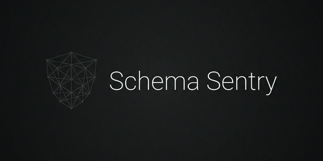

<div align="center">
  

# Schema Sentry 🛡️

**Type-safe JSON-LD structured data for Next.js App Router—built for SEO, AI discovery, and CI validation.**
  
  [Getting Started](#-install) • [Documentation](docs/) • [Examples](examples/)
</div>


Schema Sentry provides a type-safe SDK and CLI for generating, validating, and auditing JSON-LD structured data with deterministic output. Designed for predictable diffs, CI-grade enforcement, and maximum discoverability across both traditional search engines (Google, Bing) and AI-powered systems (ChatGPT, Claude, Perplexity).

**Current release:** `v0.8.0` (GitHub Bot + Pages Router + Testing)
**Next release target:** `v0.9.0` (VS Code Extension - Preview Panel + Inline Decorations)

## ✨ Features

- 🔒 **Type-safe JSON-LD builders** for 15+ schema types (Organization, Article, Product, FAQPage, HowTo, VideoObject, ImageObject, Event, Review, and more)
- 🎯 **Deterministic JSON-LD output** for clean, reviewable version control diffs
- ⚛️ **App Router `<Schema />` component** for seamless Next.js integration
- 🧭 **Manifest-driven schema coverage** ensures every route has proper structured data
- 🔍 **CLI validation** with clear, actionable errors for CI/CD pipelines
- 📊 **Schema audit** — Analyze site health, detect missing/incomplete schema
- 📥 **Automated data collection** — `collect` command scans built apps to auto-generate schema data files
- 🧪 **CLI commands** — `init`, `validate`, `audit`, `collect`, `scaffold` for complete workflows
- ✅ **Reality Check validation** — `validate` checks actual built HTML output, not just JSON files (zero false positives!)
- 👻 **Ghost route detection** — `audit` finds routes in manifest without Schema components in source code
- 🏗️ **Schema scaffolding** — `scaffold` shows copy-paste component code with full examples from URL patterns (/blog/* → BlogPosting, /products/* → Product)
- 📄 **HTML Reports** — Generate shareable reports with `--format html --output <path>`
- 🗣️ **PR Annotations** — GitHub Actions annotations with `--annotations github`
- 📴 **Zero network calls** in OSS mode (privacy-first, offline-friendly)
- 🤖 **AI-ready output** optimized for LLM consumption, citations, and AI agent recommendations

## 🧠 Why Structured Data Matters for Both Traditional and AI Search

### The Problem

Modern content discovery happens through two channels:

1. **Traditional Search** (Google, Bing) - Rich snippets, knowledge panels, improved rankings
2. **AI-Powered Discovery** (ChatGPT, Claude, Perplexity, AI agents) - Contextual answers, citations, voice assistants

Teams often add JSON-LD late, inconsistently, or incorrectly. This leads to:

- ❌ Missing rich snippets in Google search results
- ❌ AI systems failing to understand and cite your content
- ❌ Hard-to-debug CI failures after content changes
- ❌ Inconsistent JSON-LD creating noisy diffs in version control

### The Solution

Schema Sentry enforces structured data in CI, ensuring your content is:

- ✅ **Machine-readable** for both search engines and AI systems
- ✅ **Deterministically generated** for clean, reviewable diffs
- ✅ **Validated automatically** before deployment
- ✅ **Complete across all routes** via manifest-driven checks

> **AI is eating the web.** ChatGPT, Claude, Perplexity, and AI agents now drive significant traffic. Structured data is how AI understands and recommends your content.

### Schema Sentry = Better SEO + AI Discovery

| Feature | Traditional SEO | AI/LLM Discovery |
|---------|----------------|------------------|
| Rich snippets | ✅ | ✅ Better citations |
| Knowledge panels | ✅ | ✅ Contextual answers |
| Voice search | ✅ | ✅ Voice assistant results |
| AI agent recommendations | ❌ | ✅ Direct inclusion |

By using Schema Sentry, you're not just optimizing for Google—you're making your content discoverable by the next generation of AI-powered search.

## 📦 Packages

| Package | Version | Description |
|---------|---------|-------------|
| [`@schemasentry/core`](https://www.npmjs.com/package/@schemasentry/core) | [](https://www.npmjs.com/package/@schemasentry/core) | Typed builders and validation primitives |
| [`@schemasentry/next`](https://www.npmjs.com/package/@schemasentry/next) | [](https://www.npmjs.com/package/@schemasentry/next) | App Router `<Schema />` component |
| [`@schemasentry/cli`](https://www.npmjs.com/package/@schemasentry/cli) | [](https://www.npmjs.com/package/@schemasentry/cli) | CI validation and report output |

## 🚀 Install

```bash
# pnpm
pnpm add @schemasentry/next @schemasentry/core
pnpm add -D @schemasentry/cli

# npm
npm install @schemasentry/next @schemasentry/core
npm install -D @schemasentry/cli

# yarn
yarn add @schemasentry/next @schemasentry/core
yarn add -D @schemasentry/cli
```

## 🧩 App Router Usage

```tsx
import { Schema, Article, Organization } from "@schemasentry/next";

const org = Organization({
  name: "Acme Corp",
  url: "https://acme.com"
});

const article = Article({
  headline: "Launch Update",
  authorName: "Jane Doe",
  datePublished: "2026-02-09",
  url: "https://acme.com/blog/launch"
});

export default function Page() {
  return (
    <>
      <Schema data={[org, article]} />
      <main>...</main>
    </>
  );
}
```

## 🗺️ Manifest and Coverage

```json
{
  "routes": {
    "/": ["Organization", "WebSite"],
    "/blog/[slug]": ["Article"]
  }
}
```

## 🧪 CLI

### Important: Understanding the Workflow

Schema Sentry validates **reality, not just configuration files**. The CLI checks your **actual built HTML output** to ensure schema is properly rendered. This eliminates false positives that plague other tools.

**The Correct Workflow:**

1. **`init`** → Create starter manifest and data files
2. **`scaffold`** → See what code you need to add to your pages
3. **Add Schema components** → Copy-paste code into your page.tsx files
4. **`next build`** → Build your Next.js app
5. **`validate`** → Validate actual HTML output (catches missing schema!)
6. **`audit`** → Check for ghost routes and health issues

---

**Quick start**

1. Generate starter files:

```bash
pnpm schemasentry init
```

2. See what schema you need to add:

```bash
pnpm schemasentry scaffold --root ./app
```

3. Copy-paste the generated code into your page.tsx files

4. Build your Next.js app:

```bash
next build
```

5. **Validate reality** (checks actual HTML, not just config files):

```bash
pnpm schemasentry validate \
  --manifest ./schema-sentry.manifest.json \
  --root ./.next/server/app
```

6. Audit for ghost routes and issues:

```bash
pnpm schemasentry audit \
  --manifest ./schema-sentry.manifest.json \
  --root ./app
```

**All commands**

```bash
# Initialize starter files
pnpm schemasentry init
pnpm schemasentry init --scan

# See what schema code to add (shows copy-paste examples)
pnpm schemasentry scaffold --root ./app
pnpm schemasentry scaffold --root ./app --write

# Validate ACTUAL HTML OUTPUT (catches missing schema!)
pnpm schemasentry validate --manifest ./schema-sentry.manifest.json
pnpm schemasentry validate --manifest ./schema-sentry.manifest.json --build
pnpm schemasentry validate --manifest ./schema-sentry.manifest.json --root ./.next/server/app
pnpm schemasentry validate --manifest ./schema-sentry.manifest.json --root ./out

# Validate with rulesets (google rich results / ai-citation)
pnpm schemasentry validate --rules google
pnpm schemasentry validate --rules ai-citation
pnpm schemasentry validate --rules google,ai-citation

# Output formats (table default, tree, json, html)
pnpm schemasentry validate --format table
pnpm schemasentry validate --format tree
pnpm schemasentry validate --format json
pnpm schemasentry validate --format html --output ./report.html

# Audit for ghost routes (routes in manifest but no Schema component)
pnpm schemasentry audit --manifest ./schema-sentry.manifest.json --root ./app
pnpm schemasentry audit --manifest ./schema-sentry.manifest.json --root ./app --scan
# Optional legacy coverage checks (requires schema data file)
pnpm schemasentry audit --manifest ./schema-sentry.manifest.json --data ./schema-sentry.data.json --root ./app

# Collect schema from built HTML
pnpm schemasentry collect --root ./out --output ./schema-sentry.data.json
pnpm schemasentry collect --root ./.next/server/app --check --data ./schema-sentry.data.json

# Generate reports
pnpm schemasentry validate \
  --manifest ./schema-sentry.manifest.json \
  --root ./.next/server/app \
  --format html \
  --output ./report.html

pnpm schemasentry audit \
  --manifest ./schema-sentry.manifest.json \
  --root ./app \
  --format html \
  --output ./audit-report.html
```

The CLI emits table output by default for better readability. Use `--format json` for machine-readable output or `--format html --output <path>` for shareable reports.
Use `--annotations github` in GitHub Actions to emit PR annotations.
Use `--rules google` or `--rules ai-citation` to validate for specific optimization targets.
Recommended field checks run as warnings by default. Disable them with `--no-recommended`.
See `docs/ci.md` for complete CI workflow examples.

### Optional Config

Create `schema-sentry.config.json` to control defaults:

```json
{
  "recommended": false
}
```

CLI flags override config. Use `--config ./path/to/config.json` to point at a custom file.

### Understanding Manifest vs Data

| File | Purpose | How It Works |
|------|---------|---------------|
| `schema-sentry.manifest.json` | Defines **expected schema types** per route | You create this manually - tells Schema Sentry what each page should have |
| `schema-sentry.data.json` | Contains the **actual schema data** (legacy) | **DEPRECATED**: Use `schemasentry validate` instead, which checks actual HTML |

**Why validate against HTML instead of JSON files?**

Other tools validate JSON config files, which gives you **false positives**. You can have perfect JSON files but your pages still lack schema markup! Schema Sentry v0.6.0+ validates your **actual built HTML output**, ensuring your schema is truly rendered.

**Old way (v0.5.0 and earlier - DON'T DO THIS):**
```bash
# ❌ Validates JSON files against each other - FALSE POSITIVES!
schemasentry validate --manifest manifest.json --data data.json
```

**New way (v0.6.0+ - DO THIS):**
```bash
# ✅ Validates actual built HTML against manifest - NO FALSE POSITIVES!
schemasentry validate --manifest manifest.json
# or run build automatically first:
schemasentry validate --manifest manifest.json --build
```

When `--root` is omitted, `validate` auto-detects built output (`./.next/server/app`, then `./out`, then `./.next/server/pages`). Use `schemasentry init` to generate starter files. Use `schemasentry scaffold` to see what code to add. Use `schemasentry validate` (or `--build`) to verify your schema is actually rendered.

## ✅ Supported Schema Types (V1)

- Organization
- Person
- Place
- LocalBusiness
- WebSite
- WebPage
- Article
- BlogPosting
- Product
- VideoObject
- ImageObject
- Event
- Review
- FAQPage
- HowTo
- BreadcrumbList

## 🧪 Example App

A minimal Next.js App Router example lives in `examples/next-app` and includes a manifest and data file. It targets Next.js 16.1.6 and React 19.1.1.

Run the end-to-end workflow demo (`init -> collect -> validate`):

```bash
pnpm --filter schema-sentry-example-next-app schema:e2e
```

## ✅ Compatibility

- Next.js App Router (Next.js 13.4+)
- React 18+
- Node.js 18+

## 🛣️ Roadmap

See `ROADMAP.md` for planned milestones and future work.

## 🤝 Contributing

See `CONTRIBUTING.md` for workflow, scope guardrails, and expectations.

## 📄 License

MIT © Arindam Dawn

## 💬 Support

- Report bugs: https://github.com/arindamdawn/schema-sentry/issues/new?template=bug_report.md
- Request features: https://github.com/arindamdawn/schema-sentry/issues/new?template=feature_request.md
- Discussions: https://github.com/arindamdawn/schema-sentry/discussions

---

Made with ❤️ for the Next.js community
