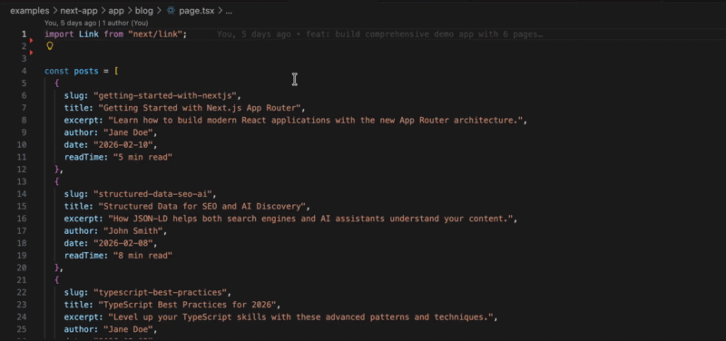

# 🛡️ Schema Sentry - VS Code Extension

**Type-safe JSON-LD structured data helpers for VS Code.**

Boost your SEO and AI discoverability with Schema Sentry's VS Code extension. Get real-time schema preview, snippets, and validation while you code.

---

## ✨ Features

### 🔌 Snippets
Type `schema-` in any `.tsx` file to see autocomplete suggestions:

| Snippet | Schema Type |
|---------|-------------|
| `schema-organization` | Organization |
| `schema-person` | Person |
| `schema-article` | Article |
| `schema-blogposting` | BlogPosting |
| `schema-product` | Product |
| `schema-faq` | FAQPage |
| `schema-howto` | HowTo |
| `schema-event` | Event |
| `schema-localbusiness` | LocalBusiness |
| `schema-website` | WebSite |
| `schema-breadcrumb` | BreadcrumbList |
| `schema-review` | Review |
| `schema-video` | VideoObject |
| `schema-image` | ImageObject |

### 👁️ Preview Panel
- Click the **status bar** item or run `Schema Sentry: Preview Schema`
- See all schema types detected in your file
- Real-time feedback as you code

### 🎯 Commands

| Command | Description |
|---------|-------------|
| `Schema Sentry: Preview Schema` | 👁️ Open preview panel |
| `Schema Sentry: Add Schema Type` | ➕ Insert schema snippet |
| `Schema Sentry: Validate File` | ✅ Show validation issues |

### 🏷️ Inline Decorations
Schema type badges appear in the gutter as you type — always know what schema you're adding!

### ⚙️ Settings

| Setting | Default | Description |
|---------|---------|-------------|
| `schemasentry.enablePreview` | `true` | Show preview panel |
| `schemasentry.enableDecorations` | `true` | Show gutter badges |

---

## 🚀 Quick Start

1. **Install**: `code --install-extension schema-sentry-vscode-0.9.0.vsix`
2. **Open** a Next.js `.tsx` file
3. **Type** `schema-` to see snippets, or click the 🛡️ status bar item

---

## 📋 Requirements

- VS Code 1.99.0+
- TypeScript/TSX or JavaScript/JSX files
- Works best with `@schemasentry/next` package

---

## 🔗 Links

- [Main Documentation](https://github.com/arindamdawn/schema-sentry)
- [NPM Packages](https://www.npmjs.com/org/schemasentry)
- [Report Issues](https://github.com/arindamdawn/schema-sentry/issues)

---

**Made with ❤️ for better SEO & AI discoverability!**
